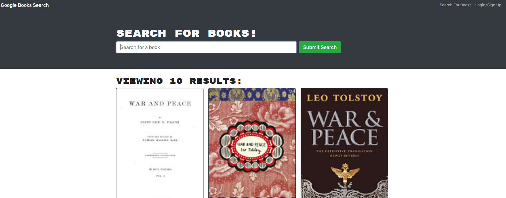

# MERN Book Search Engine

## Description:

An existing Google Books API search engine app was converted to use the GraphQL API. It uses the MERN stack with a React front end, a Node.js/Express.js server, and a MongoDB database. The existing front-end was left mostly intact

## Installation:

No installation is neccessary. The application was hosted at herokuapp.com.

## Usage:

Visit the Heroku deployment here: [link](https://mern-book-search-122.herokuapp.com/)

## License:

[MIT](https://opensource.org/licenses/MIT)

